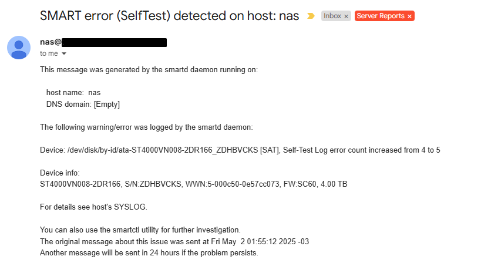

# Daniel's NAS
## About
NAS (Network Attached Storage) is a type of server that primarily serves the purpose
of serving files on the network, but in the context of home users usually has many more features.

In this context, for the last 5 years I have managed my own home server,
having a linux machine on 24/7 is really useful, not only I can share all my files across my devices,
I have Virtual machines running automation stuff and work related environments.
On top of all that, you can have a really nice media center,
having your movies, music, shows and photos being served on the network is really cool.

This project has had many prior iterations, starting with OpenMediaVault, a Linux distro specifically
tailored to NAS, to the final decision of me managing my own linux install.

This current iteration uses ansible to manage the server,
serving as a tool to deploy changes and save the server definitions as code.
Although this project is tailored made for my need, I believe it can be very useful as a boilerplate
to implement a similar server, you can check the pre requisites section to get started.

## Features
### Server setup
* Users and group creation
* Email setup
* SAMBA setup
* Auto container upgrades

### Network setup
* DDNS Cloudflare Auto Update
* Reverse Proxy NGINX

### Media and Downloads
* qBittorrent - Torrent client
* Jackett - Torrent source aggregator
* Sonarr - TV Shows automatic download
* Radarr - Movies automatic download
* Bazarr - Subtitle management
* Plex - Media server

### Backups
3-2-1 Backup strategy using the following technologies:
* ZFS Snapshots - Quick container restore
* Borg - Local backup
* Restic - Cloud backup to Backblaze B2

The following are backed up:
* Docker containers
* Immich library
* Home Assistant
* Documents

### Monitoring and reports
#### All nodes
* Promtail - Log collection
* Node Exporter - System metrics

#### NAS
* Smartmon disk monitoring with daily tests and monthly email report
* ZFS monitoring
* Prometheus
* Loki
* Grafana - Dashboards for containers and nodes
* Grafana - Alerts

## Pre requisites
### OS setup - Ubuntu
This project run against a physical machine running the latest Ubuntu LTS version.
Make sure you have a clean install, and have SSH access on your local network.

### Filesystem setup - ZFS
ZFS features are used on some tasks, it will be pretty difficult to use another filesystem.
This project *DO NOT* setup nor manage it, you should take your time to setup it properly,
before attempting to use this project.

I have setup two separate pools: **Users**, where are stored transitional files and
data files for the docker containers. And **Storage**, a 14TB pool to store all the rest.

### Email
You will need a SMP service that allow using plain text password for authentication,
I recommend using AWS SES.

### Network
* Setup your server with a static IP locally, you'll avoid a bunch of headaches.
* This projects comes with a reverse proxy and DDNS updates, but **BE CAREFUL**,
it's not a good idea to expose services that you don't need online, if you want
to access the whole server online, I strongly recommend setting up a VPN (Wireguard, OpenVPN).

### Hardware

## Configuration
Make a copy of the example invetory, and change the values in
inventories/your_inventory/inventory.yml to match your server configuration.
```sh
cp -r invetories/example invetories/your_inventory
```
All the default configuration are stored inside the roles (role_name/defaults/main.yml)
and in the group_vars directory (group_vars/all.yml).

You can override any of these values in your inventory file, just add the desired
variable with the new value to your inventories/your_inventory/group_vars/your_inventory.yml

The order of precedence of this projects is:
1. Inventory group_vars
2. Project group_vars
3. Role defaults

## Running
### Setting up
The recommended way to run this project is using VSCode Dev Container feature,
this way you can edit your files and don't have to worry about setting up ansible.

1. Clone or Fork this repository
2. Open project with VSCode
3. Open in Container

If you don't want to use VSCode, you can build the container yourself,
or setup the project manually using Poetry.

### Running a playbook
```sh
# Default playbook for the full NAS server
ansible-playbook nas_playbook.yml -i inventories/nas/inventory.yml --diff --check

# Playbook for obervability nodes
ansible-playbook exporters_playbook.yml -i inventories/pve/inventory.yml --diff --check
```

To run a tag:
```sh
# Single tag
ansible-playbook nas_playbook.yml -i inventories/nas/inventory.yml --diff --tags docker --check

# Multiple tags
ansible-playbook nas_playbook.yml -i inventories/nas/inventory.yml --diff --tags docker,system --check
```
## Media
### Hardware


### Grafana


### Email reports


## TODO
* Implement grafana alerts
* Add screenshots to the readme
* Setup local backup (In progress)
* Setup cloud backup (In progress)
* Setup tdarr
* Refactor containers network with traefik ?
