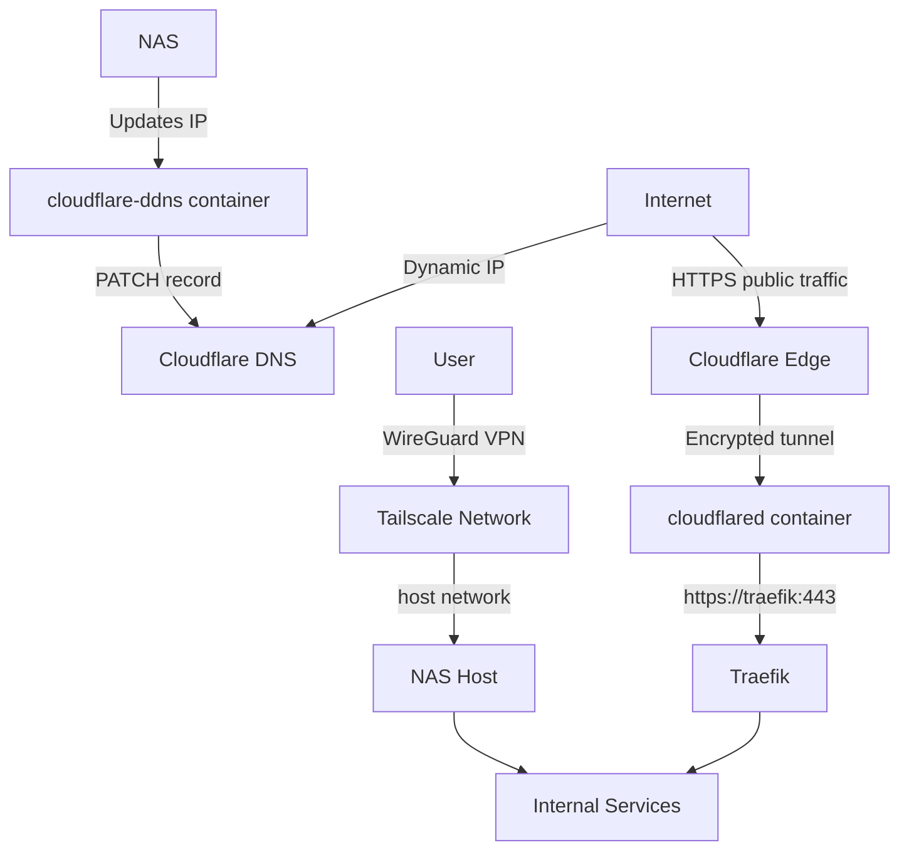
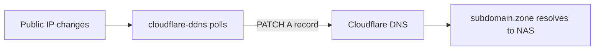
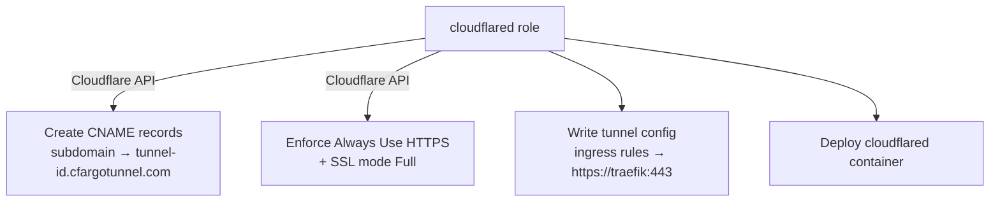
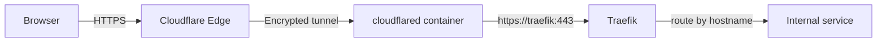
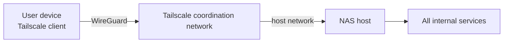

# Network Access

This NAS setup supports three complementary methods for remote access: DDNS, Cloudflare Tunnel, and Tailscale. They can be used independently or together.

## Overview

| Method | Visibility | Firewall ports required | Use case |
|---|---|---|---|
| DDNS | Public | Yes (80/443) | Direct DNS resolution to NAS IP |
| Cloudflare Tunnel | Public | None | Expose services without open ports |
| Tailscale | Private | None | Personal VPN access |

---

## DDNS

**Role:** `roles/cloudflare_ddns/`

Keeps a Cloudflare DNS A record pointing at the NAS's dynamic public IP. The `oznu/cloudflare-ddns` container polls for IP changes and patches the record via the Cloudflare API.

### Variables

| Variable | Description |
|---|---|
| `cloudflare_ddns_enabled` | Enable the role (default: `false`) |
| `cloudflare_ddns_api_key` | Cloudflare API token with DNS edit permissions |
| `cloudflare_ddns_zone` | DNS zone (e.g. `example.com`) |
| `cloudflare_ddns_subdomain` | Subdomain to keep updated (e.g. `nas`) |
| `cloudflare_ddns_proxy` | Whether to proxy through Cloudflare (`"true"`/`"false"`) |

The container is attached to the `nas` Docker network.

---

## Cloudflare Tunnel

**Role:** `roles/cloudflared/`

Exposes selected services publicly without opening any firewall ports. Traffic flows from the browser through Cloudflare's edge network into the NAS via an outbound-only encrypted tunnel.

### Ansible setup flow

### Traffic flow

### Variables

| Variable | Description |
|---|---|
| `cloudflared_enabled` | Enable the role (default: `false`) |
| `cloudflared_token` | Tunnel token (base64-encoded JSON, see below) |
| `cloudflared_public_hostnames` | List of hostnames to expose via the tunnel |
| `cloudflared_ingress_service` | Backend for tunnel ingress (default: `https://traefik:443`) |
| `cloudflared_no_tls_verify` | Skip TLS verification toward Traefik (default: `true`) |
| `cloudflared_cf_zone` | Cloudflare zone for DNS automation (defaults to `cloudflare_ddns_zone`) |
| `cloudflared_cf_api_token` | Cloudflare API token for DNS automation (defaults to `cloudflare_ddns_api_key`) |
| `cloudflared_internal_domain` | Internal domain used by Traefik (defaults to `traefik_domain`) |

### Token format

`cloudflared_token` is a base64-encoded JSON object containing:

- `.t` — tunnel ID (UUID)
- `.a` — account ID

The token is issued from the Cloudflare Zero Trust dashboard when creating a tunnel.

---

## Tailscale

**Role:** `roles/tailscale/`

Provides private WireGuard-based VPN access to the NAS. No services are exposed publicly; access is restricted to devices enrolled in the same Tailscale network.

The container runs with `network_mode: host`, giving it direct access to the NAS network stack. It requires the `NET_ADMIN` and `NET_RAW` capabilities and the `/dev/net/tun` device.

### Variables

| Variable | Description |
|---|---|
| `tailscale_enabled` | Enable the role (default: `false`) |
| `tailscale_authkey` | Tailscale auth key for device registration |
| `tailscale_hostname` | Hostname advertised to the Tailscale network |
| `tailscale_routes` | Subnet routes to advertise (e.g. `192.168.1.0/24`) |
| `tailscale_extra_args` | Additional arguments passed to `tailscale up` |
